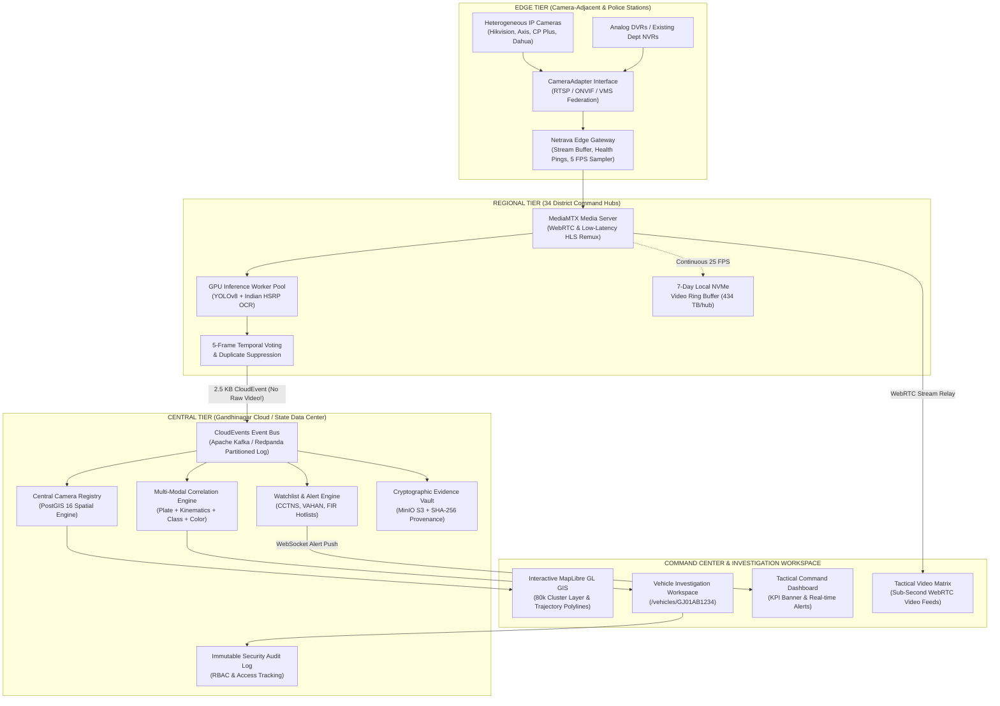
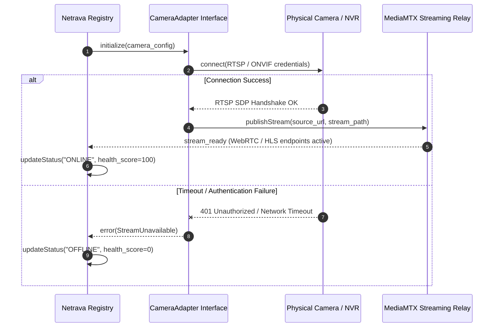
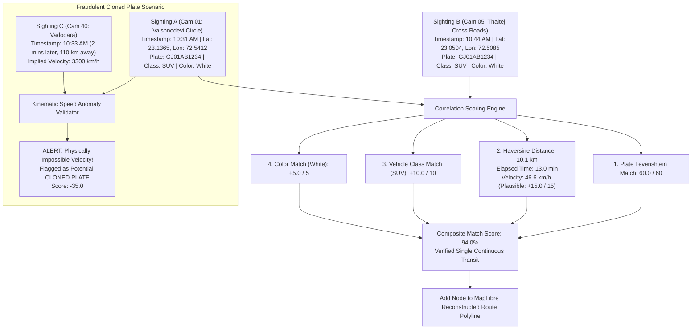
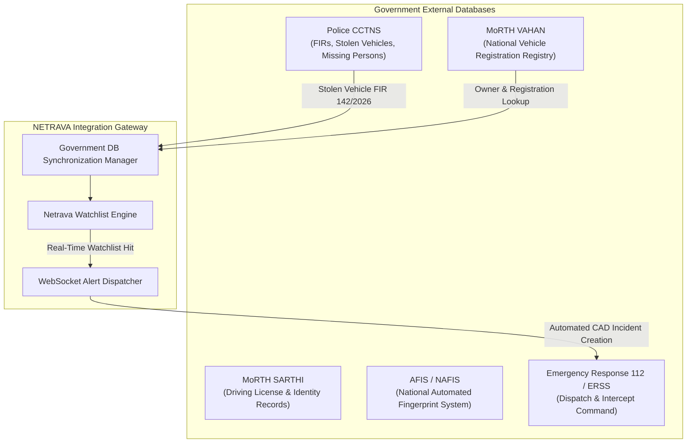

# NETRAVA: Integration & Workflow Architecture
## Edge-to-Cloud Video Intelligence Fabric
**Reference Repository Document**: `https://github.com/SH20RAJ/Netrava/blob/main/architecture.md`

---

## 1. End-to-End System Workflow Architecture

---

## 2. Camera Adapter Federation Workflow (Model 3)

The `CameraAdapter` abstraction isolates the analytics pipeline from proprietary video protocol differences:

---

## 3. Computer Vision & ANPR Temporal Voting Pipeline

```mermaid
flowchart LR
    Frame["Input Video Frame\n(1920x1080 @ 5 FPS)"] --> Det["YOLOv8 Vehicle Detector\n(Cars, SUVs, Trucks, Buses)"]
    Det --> Track["ByteTrack Object Tracker\n(Persistent Track ID trk_1042)"]
    Track --> PlateROI["License Plate Localization\n(BBox Crop: 420, 630, 540, 675)"]
    PlateROI --> OCR["Indian HSRP OCR Parser\n(MoRTH Syntax Validation)"]
    OCR --> Rectify["Syntax-Aware Character Rectification\n(O->0, D->0, B->8)"]
    Rectify --> Voter["Temporal Consensus Voter\n(5-Frame Window)"]
    Voter --> Sighting["Consensus Plate: GJ01AB1234\nConfidence: 96.4%\nVotes: 5/5"]
```

---

## 4. Multi-Modal Cross-Camera Correlation & Kinematics

Netrava evaluates transitions between surveillance points to prevent false matches and catch cloned plates:

---

## 5. Government Multi-Agency Integration Architecture

