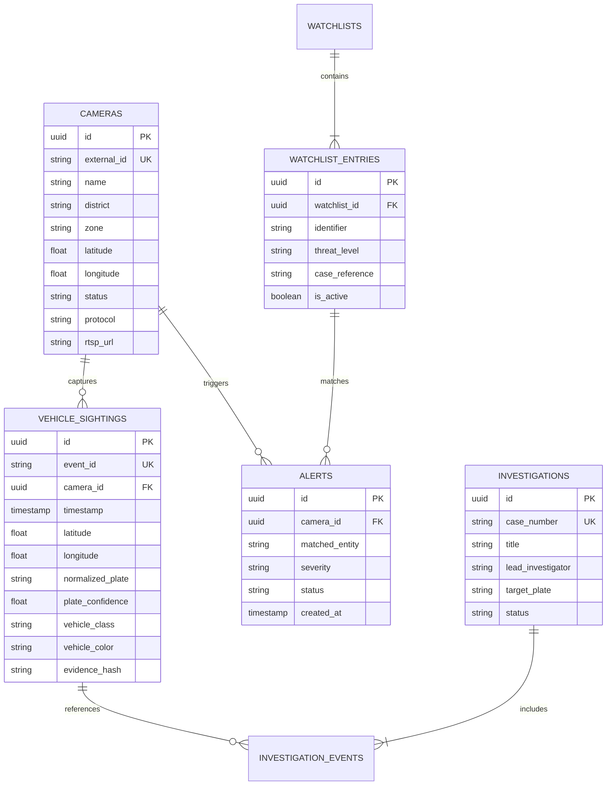
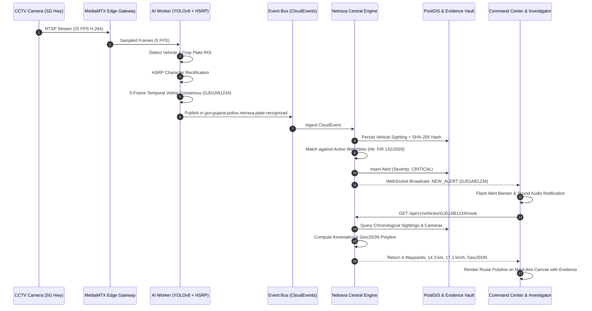

# High-Level Design (HLD): NETRAVA Video Intelligence Fabric
## Open Government Video Intelligence & Cross-Camera Investigation Platform
**Deployment Reference**: Gujarat Police Innovation Challenge 2026 / Sentinel Gujarat CCTV Integration  
**Target Scale**: Scalable from 50 prototype feeds to 80,000+ statewide camera endpoints across 34 districts and 26 government departments.

---

## 1. System Vision & Problem Statement

Gujarat's statewide surveillance network encompasses approximately 80,000 CCTV cameras operated by 26 disparate departments (Police, Municipal Corporations, GSRTC, Highways, Ports, Forest). These systems are trapped in vendor silos (Hikvision, CP Plus, Axis, Dahua, Milestone, Genetec, proprietary DVRs). 

Streaming all 80,000 feeds centrally requires **200 Gbps** of uninterrupted WAN bandwidth—economically prohibitive and physically impossible across rural and semi-urban district networks. Furthermore, manual DVR searching across jurisdictional boundaries delays criminal apprehensions by days.

**NETRAVA** introduces a **Hybrid Edge-to-Cloud Video Intelligence Fabric**:
> *"Federate what already exists, centralize intelligence where useful, and push processing toward the edge when bandwidth or latency requires it."*

---

## 2. High-Level Architectural Models & Hybrid Synthesis

Netrava harmonizes the four architectural models identified by the Gujarat Police Innovation Challenge:
- **Model 1 (CCTV Registry + GIS Foundation)**: Mandatory centralized registry of all 80,000 camera endpoints with PostGIS spatial geometry, lifecycle states (`REGISTERED`, `CONNECTING`, `ONLINE`, `DEGRADED`, `OFFLINE`), and administrative hierarchy.
- **Model 2 (Unified Viewing Gateway)**: MediaMTX-based media gateway normalizing heterogeneous RTSP, ONVIF, and vendor feeds into sub-second WebRTC and Low-Latency HLS.
- **Model 3 (VMS Federation & Middleware Adapters)**: Vendor-neutral `CameraAdapter` interface allowing legacy NVRs/VMSs to be onboarded as plugins without re-architecting the core.
- **Model 4 (Selective Central Intelligence)**: Centralized cross-camera vehicle correlation, statewide watchlists (VAHAN/CCTNS), and cryptographic evidence storage. Continuous raw video is **never** centralized.

```
                             [ EDGE TIER ]
   (Camera-Adjacent / Edge Gateways / Police Station NVRs)
 +--------------------+  +--------------------+  +--------------------+
 |  Hikvision / Axis  |  | CP Plus / Dahua IP |  | Existing Dept VMS  |
 |  RTSP / ONVIF Cam  |  |  RTSP / ONVIF Cam  |  | (Milestone/Genetec)|
 +---------+----------+  +---------+----------+  +---------+----------+
           |                       |                       |
           v                       v                       v
 +--------------------------------------------------------------------+
 |                 NETRAVA ADAPTER INTERFACE                          |
 |  - RTSPAdapter     - ONVIFAdapter     - VMSFederationAdapter       |
 +---------------------------------+----------------------------------+
                                   |
                                   v
 +--------------------------------------------------------------------+
 |                     NETRAVA EDGE GATEWAY (Local)                   |
 |  - Stream Buffer & Health Ping (5s heartbeat)                      |
 |  - Adaptive Frame Sampler (25 FPS stream -> 5 FPS Analytics)       |
 +---------------------------------+----------------------------------+
                                   |
             [ REGIONAL / DISTRICT TIER (Hubs) ]
 +---------------------------------+----------------------------------+
 |                  NETRAVA REGIONAL PROCESSING HUB                   |
 |  - MediaMTX Stream Relay (WebRTC / Low-Latency HLS)                |
 |  - High-Throughput Worker Pool (GPU YOLOv8 + Indian HSRP OCR)      |
 |  - Temporal Plate Voting & Duplicate Suppression Engine            |
 |  - Local Ring-Buffer Video Cache (NVMe Hot Store, 7-day retention) |
 +---------------------------------+----------------------------------+
                                   | Normalized Events (2.5 KB/evt)
                                   | (99.87% WAN Bandwidth Reduction)
                                   v
             [ CENTRAL STATE COMMAND TIER (Cloud / SDC) ]
 +--------------------------------------------------------------------+
 |              NETRAVA CENTRAL INTELLIGENCE FABRIC                   |
 |                                                                    |
 |  +--------------------+  +------------------+  +----------------+  |
 |  | Central Camera     |  | PostGIS Spatial  |  | Apache Kafka / |  |
 |  | Registry (80k cams)|  | Intelligence DB  |  | Redpanda Bus   |  |
 |  +--------------------+  +------------------+  +----------------+  |
 |                                                                    |
 |  +--------------------+  +------------------+  +----------------+  |
 |  | Cross-Camera Multi-|  | Watchlist Engine |  | Cryptographic  |  |
 |  | Modal Correlation  |  | (VAHAN/CCTNS/Hot)|  | Evidence Vault |  |
 |  +--------------------+  +------------------+  +----------------+  |
 +---------------------------------+----------------------------------+
                                   |
                                   v
 +--------------------------------------------------------------------+
 |            NETRAVA COMMAND & INVESTIGATION WORKSPACE               |
 |  - Tactical Command Center (Live Video Wall, KPI Banner, Alarms)   |
 |  - Spatial GIS Explorer (MapLibre GL, 80k Cluster Layer, Coverage) |
 |  - Vehicle Dossier & Route Reconstructor (Timeline + Kinematics)   |
 |  - Watchlist Manager & Live Alert Dispatcher                       |
 |  - Chain-of-Custody Evidence Viewer & Cryptographic Case Exporter  |
 +--------------------------------------------------------------------+
```

---

## 3. Subsystem Decomposition & Boundaries

### 3.1 Camera Registry & GIS Subsystem
- **Function**: Authoritative system of record for every camera node.
- **Attributes**: UUID, external identifier (e.g. `IN-GJ-AHM-0001`), name, department, district, zone, police station, WGS84 coordinates (`geometry(Point, 4326)`), elevation, vendor, model, protocol, streaming endpoint, data classification (`PUBLIC`, `INTERNAL`, `SENSITIVE`), retention schedule.
- **Spatial Queries**: PostGIS-accelerated bounding box filtering, radius proximity queries, and district centroid clustering.

### 3.2 Media Gateway Subsystem
- **Core Technology**: MediaMTX (bluenviron) + FFmpeg.
- **Ingestion**: Ingests heterogeneous RTSP (TCP/UDP), ONVIF profiles, and synthetic streams.
- **Egress**: Normalizes into sub-second WebRTC for tactical command walls and Low-Latency HLS for browser-based remote monitoring.

### 3.3 AI Inference & Computer Vision Pipeline
- **Vehicle Detection**: YOLOv8-based object detection localizing cars, SUVs, trucks, buses, motorcycles, and auto-rickshaws.
- **ANPR Subsystem**:
  - High Security Registration Plate (HSRP) standard validation conforming to Indian MoRTH syntax (`^[A-Z]{2}[0-9]{1,2}[A-Z]{0,3}[0-9]{4}$`).
  - Position-aware character confusion matrix correction (e.g., swapping 'O' for '0' in RTO code zone).
  - **Temporal Consensus Voting**: Aggregates candidate OCR strings across 5 frames to eliminate optical flicker and transient misreadings.
- **Tracking**: Per-camera ByteTrack assigning persistent local track IDs.

### 3.4 Multi-Modal Cross-Camera Correlation Subsystem
Rejects simplistic `plate_A == plate_B` matching. Computes an explainable composite match score:
$$\text{MatchScore} = S_{\text{plate}} (60) + S_{\text{kinematic}} (15) + S_{\text{class}} (10) + S_{\text{color}} (5) + S_{\text{visual}} (10)$$
- **Kinematic Plausibility Engine**: Checks velocity between sighting $A(t_1, x_1, y_1)$ and $B(t_2, x_2, y_2)$ using Haversine distance:
  $$v = \frac{\text{haversine}(x_1, y_1, x_2, y_2)}{t_2 - t_1}$$
  If $v > 180\text{ km/h}$, flags an immediate **CLONED / FRAUDULENT PLATE ALERT**.

### 3.5 Watchlist & Alert Dispatcher Subsystem
- **Watchlists**: Synchronized with CCTNS FIR records, VAHAN stolen vehicle registries, and CID hotlists. Threat levels: `CRITICAL`, `HIGH`, `MEDIUM`, `LOW`, `INFO`.
- **Alert Dispatcher**: Sub-second alert broadcasting via WebSockets with configurable 5-minute deduplication windows.

### 3.6 Cryptographic Evidence Vault Subsystem
- Every detection event optionally archives forensic frame crops and plate crops to S3/MinIO.
- Automatically calculates and binds a deterministic **SHA-256 integrity hash** to satisfy Section 65B of the Indian Evidence Act.
- Immutable audit logging of all investigator access.

---

## 4. Data Architecture & Database Schema



---

## 5. End-to-End Sequence: The North-Star Hackathon Flow



---

## 6. Network & Sizing Architecture (80,000 Cameras)

### 6.1 Bandwidth Engineering
- **Naive Central Streaming**:
  $$\text{BW}_{\text{naive}} = 80,000 \times 2.5 \text{ Mbps} = \mathbf{200 \text{ Gbps}}$$
- **Netrava Edge-to-Cloud Fabric**:
  - Event Metadata Rate: $80,000 \text{ cams} \times 0.2 \text{ evts/sec} = 16,000 \text{ evts/sec}$.
  - CloudEvent Size: $2.5 \text{ KB}$.
  - Metadata Bandwidth: $(16,000 \times 2.5 \times 8) / 1,024 = 320 \text{ Mbps}$.
  - Alert Evidence Clips (on-demand): $16 \text{ Mbps}$.
  - **Total Statewide Central WAN Bandwidth**: $\mathbf{336 \text{ Mbps}}$ ($\mathbf{99.87\%}$ reduction).

### 6.2 Compute Sizing (District Hubs)
- Total Statewide Inferences: $80,000 \times 5 \text{ FPS} = 400,000 \text{ inferences/sec}$.
- Per District Hub (34 Districts): $\approx 2,352 \text{ cameras} \times 5 \text{ FPS} = 11,765 \text{ inferences/sec}$.
- Using NVIDIA L4 (TensorRT INT8 batch-8 throughput $\approx 350 \text{ FPS}$):
  $$\text{GPUs per District Hub} = \frac{11,765}{350} \approx \mathbf{34 \text{ GPUs (e.g. 4 servers with 8x L4 each)}}$$
- **Statewide Total**: $1,156 \text{ GPUs}$.

### 6.3 Tiered Storage Sizing
- **Tier 1 (Hot - District NVMe Ring Buffer)**: 7 days continuous cyclic video storage per camera = $434 \text{ TB}$ per district ($14.75 \text{ PB}$ distributed statewide).
- **Tier 2 (Warm - State Data Center MinIO S3)**: Tamper-evident evidence clips and metadata for 1 year = $\approx 80 \text{ TB}$.
- **Tier 3 (Cold - Archive / Tape)**: Statutory criminal evidence preserved for 7 years.

---

## 7. Security, Privacy & Statutory Conformance

1. **Role-Based Access Control (RBAC)**: Partitioned into 7 operational roles (`SUPER_ADMIN`, `STATE_ADMIN`, `DISTRICT_ADMIN`, `CONTROL_ROOM_OPERATOR`, `INVESTIGATOR`, `ANALYST`, `AUDITOR`).
2. **Immutable Audit Trails**: Every plate search, live stream access, and case export logs actor ID, role, IP address, timestamp, and query parameters.
3. **Evidence Integrity**: Section 65B Indian Evidence Act compliant through deterministic SHA-256 hashing.
4. **Data Privacy**: Configurable retention policies, automatic cyclic overwriting of non-flagged video, and PII masking capabilities.
